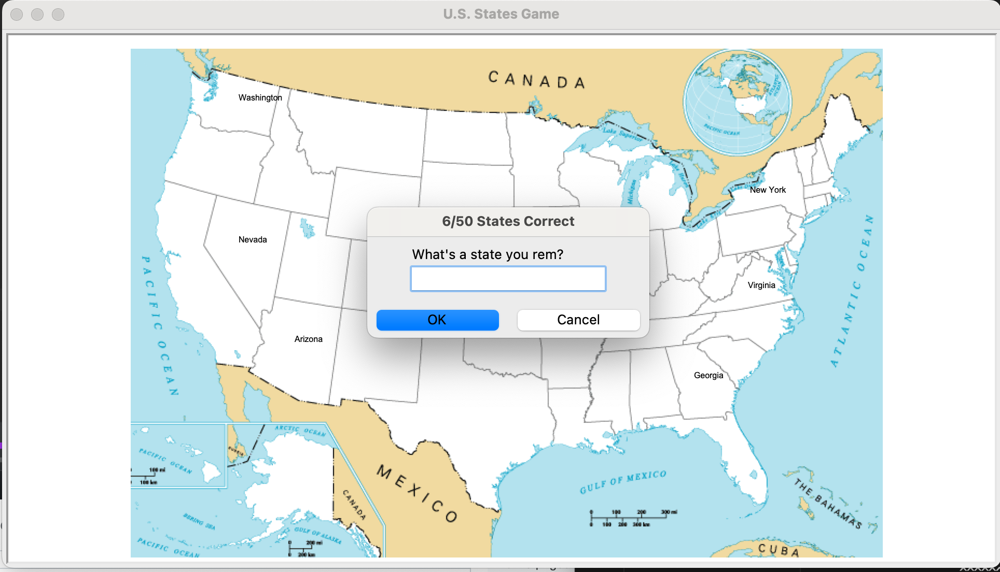

# Can you name the US states? - quiz using turtle and csv data

[Original quiz](https://www.sporcle.com/games/g/states)

## Description:
* Every time you type correct name of a state the state will be label on map and you will score 1 point.
* Score is recorded and will show you your current result. 
* When you will not know any other state -> type "exit" and program will be closed.
* Additionally program will save in csv state that you missed - as a note for you to learn more and come back to game!

