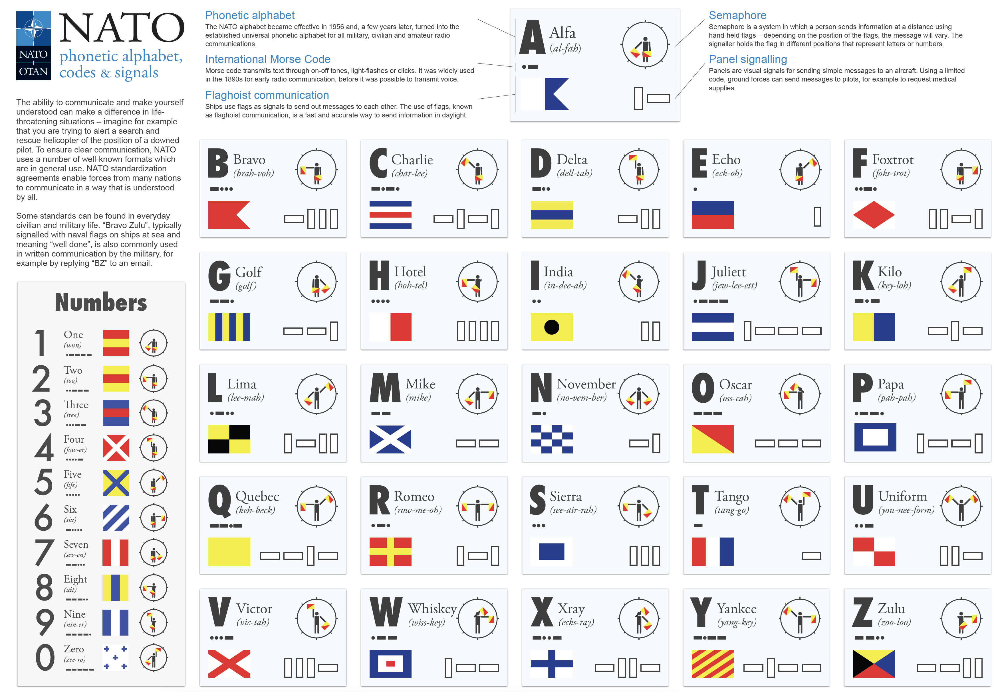

# NATO phonetic alphabet converter - learning comprehension list/dictionary

Using NATO phonetic alphabet program convert provided word to code that corresponds to each of the letters in that word. 

### Program will:
 1. Ask for word
 2. Display a list of corresponding NATO code 

### Example:
> Enter a word: Phoebe

### Output:
> ['Papa', 'Hotel', 'Oscar', 'Echo', 'Bravo', 'Echo']